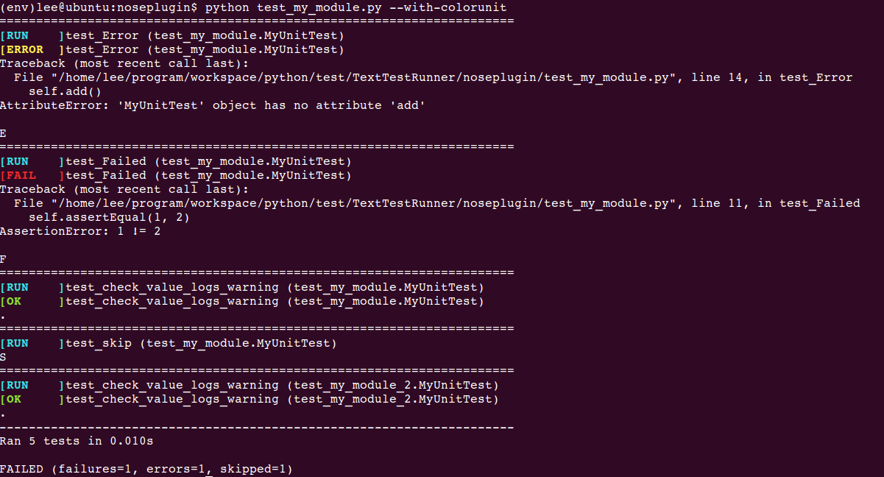

[TOC]


colorunit: `A nose plugin`
=====================

###Why?
   Why do I write  this plugin for [nose][nose], The reason is so sample that the nose original output is so ugly, what's the worse, not friendly for tester, actually python tester.

**The Original Output**:
```
(env)lee@ubuntu:noseplugin$ python test_my_module.py
EF.S.
======================================================================
ERROR: test_Error (test_my_module.MyUnitTest)
----------------------------------------------------------------------
Traceback (most recent call last):
  File "/home/lee/program/workspace/python/test/TextTestRunner/noseplugin/test_my_module.py", line 14, in test_Error
    self.add()
AttributeError: 'MyUnitTest' object has no attribute 'add'

======================================================================
FAIL: test_Failed (test_my_module.MyUnitTest)
----------------------------------------------------------------------
Traceback (most recent call last):
  File "/home/lee/program/workspace/python/test/TextTestRunner/noseplugin/test_my_module.py", line 11, in test_Failed
    self.assertEqual(1, 2)
AssertionError: 1 != 2

----------------------------------------------------------------------
Ran 5 tests in 0.007s

FAILED (SKIP=1, errors=1, failures=1)
```
Actually, The output isn't colorful. Don't tell me that you just like the style of output !

Now:



------------------------------------------

###What?
What Does I do? I just write a class called **`ColorUnit`** which is inherited from **`nose.plugins.Plugin`**.

For more this, see:
> [nose Developing](https://nose.readthedocs.org/en/latest/developing.html)

> [WritingPlugins](http://python-nose.googlecode.com/svn/wiki/WritingPlugins.wiki)

> [Plugin Interface](http://nose.readthedocs.org/en/latest/plugins/interface.html#plugin-interface-methods)

--------------------------------

###How?
How to use this nose plugin: **`colorunit`**

Only tree steps you need to follow:

* **Install `colorunit`**:

	Active your own python virtual environment if you have. 
	
	> python setup.py build

	> python setup.py install
	
	* If you just want to install it as a `super user` or using `sudo` command, please think it **again**.


*  **Register `colorunit`**
	
	Just write the following code snippet into **Any one** of your test files, for example, `test_demo.py`. 

		import nose
		from colorunit import ColorUnit
		if __name__ == '__main__':
    		nose.main(addplugins=[ColorUnit()])

	By the way, I'm always confused that When the plugin has been installed using `setuptools`, why it also needs to be registered again!


* **Run the test files**
	
	> python   test_demo.py **`--with-colorunit`**
	
	If there isn't **`--with-colorunit`**, the output will be the original output!

-----------------------------------------------

###Who?
> `Name`: **Lesus**

> `Email`: **walkingnine@gmail.com**

> `Blog`: **http://my.oschina.net/swuly302/blog** (Chinese)

If you have some good advice or idea, Welcome to communicate with me via email or be one of contributors!
 
--------------------------------------

###Drawbacks
* Only for Linux[Fixed v0.1.2];

* Why it needs to be registered again. For more informations, Please see **`How`** section

-----------------------------------------------

###Thanks!

* [`Vim 7.4`](http://vim.wendal.net/)

* [`stackedit`](http://benweet.github.io/stackedit)

* [`nose`][nose]

* [`blessing`](https://pypi.python.org/pypi/blessings/1.5)

----------------------------------------

###LICENSE
[**`APACHE LICENSE VERSION 2.0`**](http://www.apache.org/licenses/LICENSE-2.0.html)


[nose]:https://nose.readthedocs.org/en/latest/
