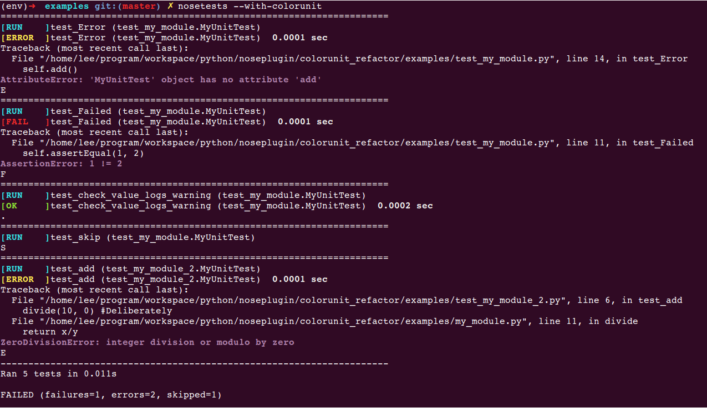

colorunit: `A nose plugin`
=====================

###Why?
   Why do I write  this plugin for [nose][nose], The reason is so sample that the nose original report is so ugly, what's the worse, not friendly for tester, actually python tester.

###Snapshot
**The Original report**:


**Now**:

Ubuntu:



Windows XP:    


------------------------------------------
###What?
What Does I do? I just write a class called **`ColorUnit`** which is inherited from **`nose.plugins.Plugin`**.

For more this, see:
> [nose Developing](https://nose.readthedocs.org/en/latest/developing.html)

> [WritingPlugins](http://python-nose.googlecode.com/svn/wiki/WritingPlugins.wiki)

> [Plugin Interface](http://nose.readthedocs.org/en/latest/plugins/interface.html#plugin-interface-methods)

--------------------------------

###How?
How to use this nose plugin: **`colorunit`**

Only tree steps you need to follow:

####Install `colorunit`:
######Install with pip
> pip install `nose-colorxunit`

######Uninstall with pip
> pip uninstall `nose-colorxunit`

######Install with source
* First, active your own python virtual environment if you have. 
	
> python setup.py build

> python setup.py install
	
* If you just want to install it as a `super user` or using `sudo` command, please think it **again**.

######Uninstall with source
Just go to your own python virtual environment `site-packages` directory, and find `nose_colorxunit-*.*.*-py*.*.egg`, then delete it.

####Register `colorunit` [Optional]
Now this is optional, just write the following code snippet into **Any one** of your test files if you like, for example, `test_demo.py`. 
```python
import nose
from colorunit import ColorUnit
if __name__ == '__main__':
    nose.main(addplugins=[ColorUnit()])
```

####Run the test files
> nosetests **`--with-colorunit`**

Without **`--with-colorunit`**, the output will be the original report!

*Note:*
	
	Be sure that you are working in your own python virtual environment

-----------------------------------------------
###Who?
> `Name`: **Lesus**

> `Email`: **walkingnine@gmail.com**

> `Blog`: **http://my.oschina.net/swuly302/blog** (Chinese)

If you have some good advice or idea, Welcome to communicate with me via email or be one of contributors!
 
----------------------------
###Drawbacks
* Only for python2.*, not supports python3.*.

-----------------------------------------------
###TODO
* Adding a decorator class or method for finding and showing these taken time over your expected taken time.

* Logging the output into specific file

----------------------
###Issues
* Only for Linux[Fixed v0.1.2];

* Showing every test case taken time[Fixed v0.1.4]

* Why it needs to be registered again. For more informations, Please see **`How` : `Register colorunit`** section [Fixed v0.1.4]

-----------------------------------------
###Thanks!
* [`Vim 7.4`](http://vim.wendal.net/)

* [`stackedit`](http://benweet.github.io/stackedit)

* [`nose`][nose]

* [`colorama`](https://pypi.python.org/pypi/colorama)


----------------------------------------

###LICENSE
[**`APACHE LICENSE VERSION 2.0`**](./LICENSE)

Also see `LICENSE` file


[nose]:https://nose.readthedocs.org/en/latest/
